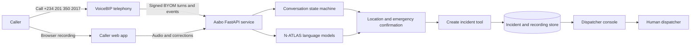

# Aabo

**Speak in your language. Confirm what was heard. Reach a human dispatcher.**

[Open Aabo](https://aabo-production.up.railway.app) · [Dispatcher console](https://aabo-production.up.railway.app/dispatch) · **Call +234 201 350 2017**

Aabo is a voice-first emergency intake system built for Nigeria. A caller can describe an emergency in Nigerian English, Yoruba, Hausa, or Igbo; Aabo collects and confirms the location and emergency details, then creates a structured incident for human review.

Aabo supports emergency intake and coordination. It is not connected to Nigeria's public emergency infrastructure and must not be treated as a replacement for an official emergency service.

## Why Aabo

A Nigerian health-system profile reports that only 3% of people call an ambulance during an emergency, while 78% call family or friends or arrange transport themselves. Aabo addresses one part of that trust and access gap: being understood quickly, in a familiar language, with enough verified context for a dispatcher to act.

Source: [Nigeria Health Systems and Services Profile, African Health Observatory Platform](https://ahop.aho.afro.who.int/download/service-delivery-nigeria-health-systems-and-services-profile/)

## What works today

| Capability | Status | Notes |
|---|---|---|
| Inbound voice | Live | Call **+234 201 350 2017**; VoiceBIP carries the call and Aabo owns the conversation state. |
| Caller web report | Live | Record a short report, review the transcript and address, and submit it for dispatch review. |
| Dispatcher console | Live | Review incidents, compare raw and caller-corrected text, and replay the original recording. |
| N-ATLAS transcription | Live | Self-hosted language-specific ASR for Nigerian English, Yoruba, Hausa, and Igbo recordings. |
| SMS intake | Integration ready | Signed webhook ingestion and acknowledgement are implemented; the public number still requires an SMS-enabled carrier channel. |
| NIPOST resolution | Access pending | The integration boundary is defined; postcode resolution remains disabled until the required production API scope is available. |

## The caller journey

1. The caller selects or speaks Nigerian English, Yoruba, Hausa, or Igbo.
2. Aabo asks for the easiest useful location: a street, junction, landmark, market, school, hospital, town, or postcode.
3. Aabo repeats the location and asks the caller to confirm or correct it.
4. The caller briefly describes the emergency.
5. Aabo repeats the emergency description. An incident is created only after the caller says yes.
6. Aabo confirms that the report is with a dispatcher, offers a short calming safety instruction, and ends the call.

The explicit confirmation steps are intentional. Speech recognition can mishear names and Nigerian addresses, so model output is never silently presented as caller-confirmed fact.

## How it works



VoiceBIP currently performs live speech recognition and synthesis on phone calls, then sends normalized text turns to Aabo's signed BYOM webhook. When audio is available, N-ATLAS processes the stored recording for the incident record. The browser flow sends audio directly to the same N-ATLAS gateway and preserves both the original output and the caller's correction.

This boundary is important: Aabo owns the personality, questions, confirmations, tool calls, incident data, and dispatcher experience. The telephony provider can be replaced without rewriting the core workflow.

## Design principles

- **Human in the loop:** automation gathers and organizes; a dispatcher makes the operational decision.
- **Confirm before submission:** both location and emergency details must be confirmed before the incident tool runs.
- **Evidence over confidence:** the original audio, raw transcript, corrected transcript, language, and provenance remain visible.
- **Graceful degradation:** an imperfect report is flagged for review instead of being silently discarded.
- **Privacy by default:** phone numbers are keyed hashes, credentials stay server-side, and signed recording URLs are not persisted.

## Repository structure

```text
backend/
  app/api/             HTTP routes and provider adapters
  app/core/            configuration, security, and logging
  app/repositories/    SQLite persistence boundaries
  app/services/        conversation, audio, transcription, and incident workflows
  migrations/          ordered database migrations
  tests/               API, state-machine, security, and integration tests
frontend/
  src/features/caller/       caller voice-report experience
  src/features/dispatch/     dispatcher incident console
  src/features/transcription/ N-ATLAS language lab
docs/                   architecture, agent, operations, and model documentation
.github/                CI and contribution templates
```

## Run locally

### Requirements

- Python 3.11
- Node.js 20.19+ or 22.12+
- Git

### 1. Configure the application

```powershell
Copy-Item .env.example .env
```

At minimum, replace `PHONE_HASH_SALT`. Add provider credentials only for the integrations you are exercising. Never commit `.env`.

### 2. Start the API

```powershell
Set-Location backend
python -m venv .venv
.\.venv\Scripts\Activate.ps1
python -m pip install -r requirements-dev.txt
uvicorn app.main:app --reload --port 8000
```

The health endpoint is `http://localhost:8000/health`; interactive API documentation is available at `http://localhost:8000/docs`.

### 3. Start the web application

```powershell
Set-Location frontend
npm.cmd install
npm.cmd run dev
```

Open `http://localhost:5173/` for the caller experience and `http://localhost:5173/dispatch` for the dispatcher console.

## Verify a change

```powershell
Set-Location backend
.\.venv\Scripts\python.exe -m ruff check app tests
.\.venv\Scripts\python.exe -m pytest

Set-Location ..\frontend
npm.cmd run build
npm.cmd audit
```

The call-state tests assert that no incident is created before location and emergency confirmation. See [`backend/tests/test_voicebip.py`](./backend/tests/test_voicebip.py).

## Documentation

- [Architecture](./docs/ARCHITECTURE.md) — system boundaries and end-to-end data flow
- [Agent design](./docs/AGENT.md) — personality, multilingual prompts, confirmation, and tool policy
- [Operations](./docs/OPERATIONS.md) — deployment readiness and failure handling
- [N-ATLAS on Modal](./docs/MODAL.md) — model hosting and cold-start procedure
- [Model improvement](./docs/MODEL_IMPROVEMENT.md) — consented correction and review workflow
- [Roadmap](./docs/ROADMAP.md) — activation gates and planned channels
- [Roadmap issue backlog](./docs/ISSUE_BACKLOG.md) — ready-to-create phase-two issue definitions

## Contributing

Please read [CONTRIBUTING.md](./CONTRIBUTING.md). Pull requests must include tests for changed behavior and must not contain credentials or real caller data.

## License

Licensed under the [Apache License 2.0](./LICENSE).

---

Every Nigerian deserves to be heard—in their own language, on the device in their hand, with a location that first responders can actually find. Aabo is a promise that when you call for help, someone will understand you, and someone will come.
