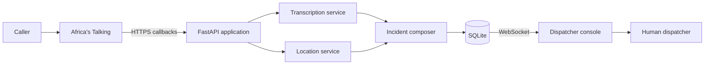

# Aabo 112

Aabo 112 is a voice-first emergency intake and incident coordination system for Nigeria. It converts a caller's report into a structured incident record containing a transcript, emergency category, location, verification signals, and dispatcher status.

The system is designed around a strict human-in-the-loop boundary: automated components collect and organize information, while a dispatcher reviews every incident before action is taken.

> **Project status:** active development. Aabo 112 is not currently connected to Nigeria's public emergency infrastructure and must not be used as a replacement for an official emergency number.

## Capabilities

- Voice intake through Africa's Talking callbacks
- Nigerian-language transcription through the N-ATLaS English, Yoruba, Hausa, and Igbo models, with a secondary ASR path
- Classification into medical, fire, security, accident, or other
- Spoken-location extraction and NIPOST postcode resolution
- Location consistency and spoof-risk signals
- Live incident delivery to a dispatcher console
- Explicit dispatcher confirmation or rejection

## Architecture



Aabo 112 is a modular monolith. The API, processing pipeline, persistence layer, and realtime gateway run as one deployable service. External providers are isolated behind service interfaces so they can be replaced without changing the HTTP or domain layers.

See [docs/ARCHITECTURE.md](./docs/ARCHITECTURE.md) for component boundaries and data flow.

## Repository layout

```text
.
├── backend/
│   ├── app/
│   │   ├── api/             HTTP routes and dependencies
│   │   ├── core/            Configuration and logging
│   │   ├── repositories/    SQLite persistence
│   │   ├── services/        Application workflows
│   │   ├── database.py      Connection and migration management
│   │   └── models.py        API and domain models
│   ├── migrations/          Ordered SQL migrations
│   └── tests/               Focused API and persistence tests
├── frontend/
│   └── src/
│       ├── api/             Backend client
│       ├── components/      Shared interface components
│       ├── features/        Incident and map features
│       └── hooks/           Reusable React behavior
├── docs/                    Architecture, operations, and roadmap
└── .github/                 Contribution templates
```

## Requirements

- Python 3.11
- Node.js 20.19+ or 22.12+
- Git
- An HTTPS tunnel for local callback development
- Africa's Talking credentials for voice calls

N-ATLAS and NIPOST credentials are required when enabling their respective integrations.

The N-ATLaS model repositories require accepting their access terms on Hugging Face before the configured token can invoke them. Access is required for `NCAIR1/NigerianAccentedEnglish`, `NCAIR1/Yoruba-ASR`, `NCAIR1/Hausa-ASR`, and `NCAIR1/Igbo-ASR`.

## Local setup

### Configuration

```powershell
Copy-Item .env.example .env
```

Set a unique `PHONE_HASH_SALT`. Do not commit `.env`.

For voice ingestion, set `AT_RECORDING_ALLOWED_HOSTS` to the comma-separated hostnames observed in trusted Africa's Talking recording callbacks. Production startup rejects an empty allowlist.

### Backend

```powershell
Set-Location backend
python -m venv .venv
.\.venv\Scripts\Activate.ps1
python -m pip install -r requirements-dev.txt
uvicorn app.main:app --reload --port 8000
```

Verify the service:

```powershell
Invoke-RestMethod http://localhost:8000/health
```

OpenAPI documentation is available at `http://localhost:8000/docs`.

### Dispatcher console

In a second terminal:

```powershell
Set-Location frontend
npm.cmd install
npm.cmd run dev
```

Open `http://localhost:5173`.

## Voice provider configuration

Expose the API over HTTPS:

```powershell
ngrok http 8000
```

Set `BASE_URL` in `.env` to the generated HTTPS origin and configure the Africa's Talking incoming-call callback as:

```text
POST https://your-domain.example/voice/incoming
```

The response contains the session-specific recording callback URL. Provider recording URLs are never written to logs or persistent storage.

## Quality checks

Run the backend checks:

```powershell
Set-Location backend
.\.venv\Scripts\python.exe -m ruff check app tests
.\.venv\Scripts\python.exe -m pytest
```

Build and audit the console:

```powershell
Set-Location frontend
npm.cmd run build
npm.cmd audit
```

## API surface

| Method | Path | Purpose |
|---|---|---|
| `GET` | `/health` | Service health and version |
| `POST` | `/voice/incoming` | Register a call and return provider XML |
| `POST` | `/voice/language` | Persist the caller's keypad language selection |
| `POST` | `/voice/recording` | Accept recording metadata for ingestion |
| `POST` | `/voice/end` | Close a call session |

The API uses Africa's Talking field names at the provider boundary and normalized Python names internally.

## Delivery priorities

Current engineering priorities are maintained in [docs/ROADMAP.md](./docs/ROADMAP.md). Work proceeds vertically: each capability includes persistence, operator visibility, failure handling, and documentation before the next capability begins.

## Security

- Caller numbers are stored only as keyed SHA-256 hashes.
- Signed recording URLs are excluded from logs and storage.
- Secrets and runtime data are ignored by Git.
- Low-confidence incidents are flagged for review, never silently discarded.
- Production mode requires HTTPS and a non-default phone hash salt.

See [SECURITY.md](./SECURITY.md) for reporting and data-handling guidance.

## Contributing

Read [CONTRIBUTING.md](./CONTRIBUTING.md) before opening a pull request.
